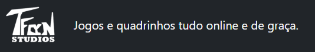
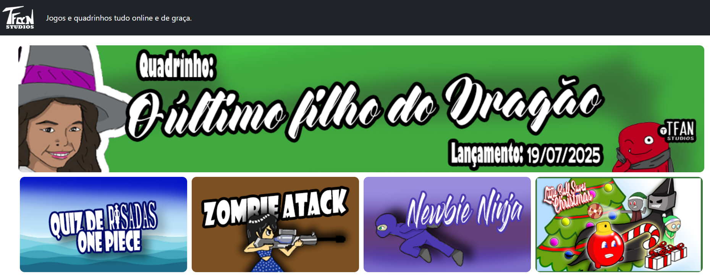

# 🎮 TFAN Studios

🌐 **Site:** https://tfanstudios.com.br

## 📌 Descrição
O **TFAN Studios** é uma plataforma de jogos autorais onde são publicados projetos desenvolvidos pelo autor e compilados na **Unity** para **HTML5 / WebGL**. Os jogos são disponibilizados **gratuitamente**, permitindo que qualquer pessoa jogue diretamente pelo navegador, sem necessidade de instalação.

O projeto foi estruturado de forma simples para ser hospedado via **GitHub Pages**, funcionando como um hub central de jogos independentes e experimentais.

---

## 🧠 Objetivo do Projeto
- Publicar jogos autorais de forma gratuita  
- Centralizar projetos desenvolvidos em Unity  
- Facilitar o acesso via navegador (WebGL)  
- Servir como portfólio de jogos e experiências interativas  

---

## 🛠️ Tecnologias Utilizadas
- Unity (exportação WebGL)  
- HTML5  
- CSS3  
- JavaScript  
- GitHub Pages  

---

## 🕹️ Conteúdo da Plataforma
- Jogos autorais em diferentes estilos  
- Projetos experimentais e educacionais  
- Jogos temáticos e sazonais  
- Quadrinhos digitais (em expansão)  

---

## 📂 Estrutura do Projeto (simplificada)
```
tfanstudios/
│
├── componentes/
├── public/
│ ├── config/
| │  ├── app.js
│ |  └──  estilos.css
| |
│ ├── imagens/
| |  ├── jogos/
| |  |  ├── logo-jogo1.png
| |  |  ├── logo-jogo2.png
| |  |  └── logo-jogo3.png
| |  | 
| |  ├── logo-branco.png
| |  ├── logo-p&b.png
| |  └── logo.png
| |
│ └── paginas/
|   ├── pages_controll.js
|   ├── administracao/
|   |  └── adm.js
|   |
|   ├── home/
|   |  └── home.js
|   |
|   ├── jogos/
|   |  ├── jogos.html
|   |  ├── jogos.json
|   |  └── jogos.js
|   |
|   └── jogos_internos/
|      └── QuizRizadas.js
|
├── index.html
└── README.md
```
---

## 🚀 Acesso ao Projeto
O projeto pode ser acessado diretamente pelo navegador:

👉 https://tfanstudios.com.br

Ou via GitHub Pages após o deploy do repositório.

---

## 🎨 Proposta Criativa
O TFAN Studios funciona como um laboratório criativo, reunindo:
- Desenvolvimento de jogos independentes  
- Experimentação com mecânicas simples  
- Publicação acessível e aberta  

---

## 📌 Próximos Passos
- Integração com sistema de ranking online  
- Padronização visual dos jogos  
- Inclusão de novos projetos Unity  
- Expansão da área de quadrinhos digitais  

---

## 📄 Licença
Os jogos e conteúdos publicados possuem licença definida individualmente. Consulte cada projeto para mais detalhes.

